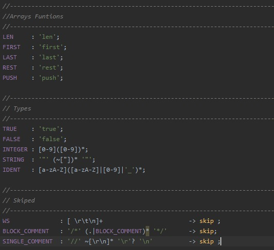
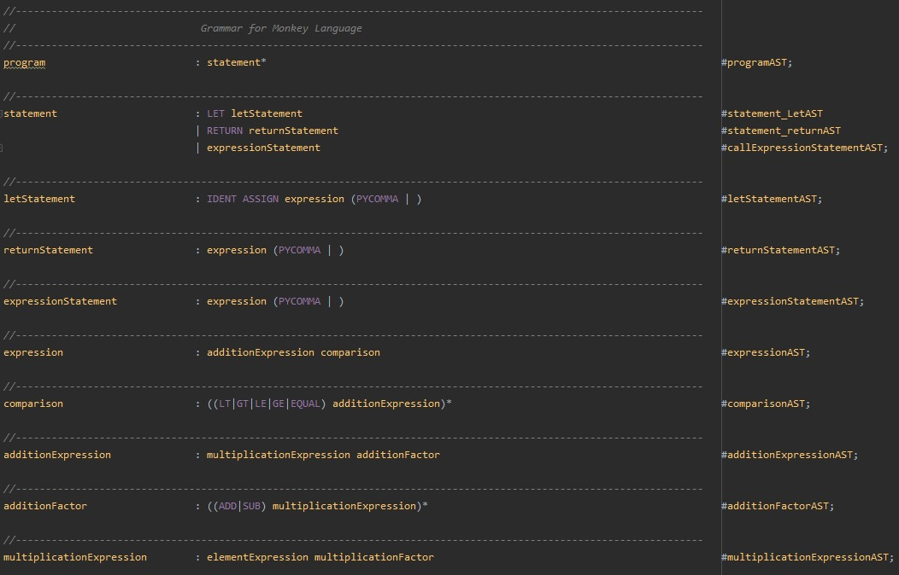
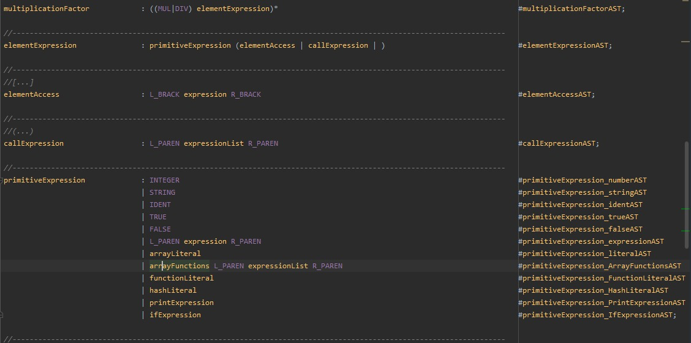
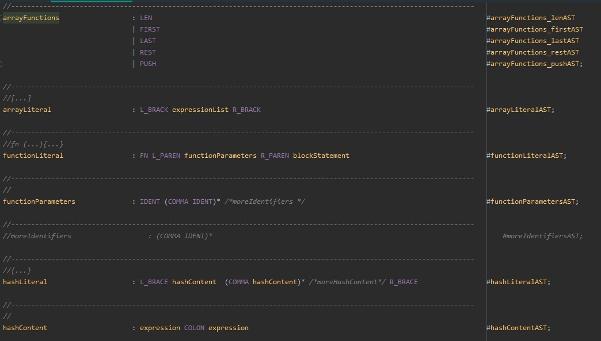
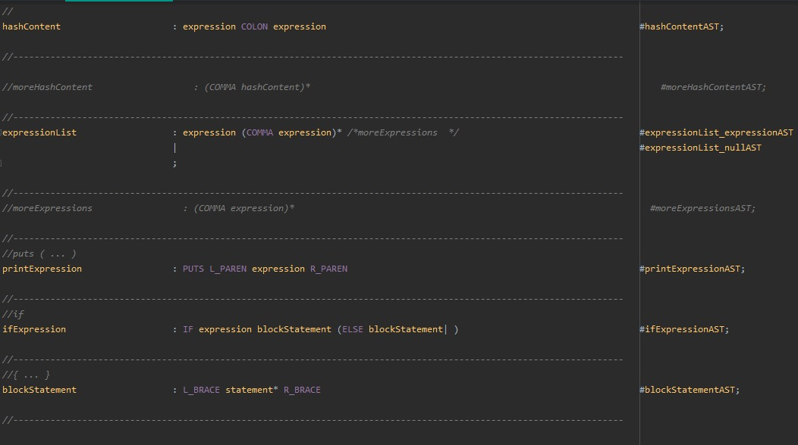
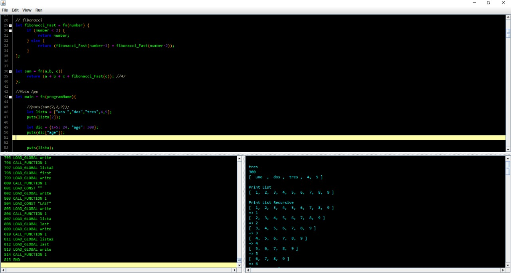

# Proyecto #1 de Compiladores

**Tip: Por favor siga los pasos que se muestran a continuación para poder ejecutar el proyecto de manera satisfactoria**. 

# Librerías

**Tip: El primer paso será instalar las librerías necesarias que se adjuntan en la carpeta "libs" del proyecto, solo es necesario dar click derecho y en la opción de "Add as library", seguidamente se debe iniciar el servidor de la maquina virtual, para eso solo es necesario abrir el proyecto que se llama VM_CS que se encuentra en una carpeta en la raiz del proyecto y ejecutarlo para proceder a correr el IDLE**

## ANTLR V4

ANTLR v4 es una poderosa herramienta utilizada para crear nuevos lenguajes de programación y procesar / traducir texto binario o texto estructurado. ANTLR utiliza una gramática que usted crea para generar un analizador que puede construir y atravesar un árbol de análisis (o árbol de sintaxis abstracta, AST).

## Rsyntaxtextarea

RSyntaxTextArea es un componente de texto de resaltado de sintaxis personalizable para aplicaciones Java Swing. De fábrica, admite resaltado de sintaxis para más de 40 lenguajes de programación, plegado de código, búsqueda y reemplazo, y tiene bibliotecas complementarias para completar el código y revisar la ortografía. Se puede agregar resaltado de sintaxis para idiomas adicionales mediante herramientas como JFlex.

# Scanner

**Tip: Para la solución del Scanner, se utilizo la librería ANTLR v4**.

# Parser

Tip: Para la solución del Parser al igual que el Scanner, se utilizo la librería ANTLR v4.

# Interfaz

Tip: Para la solución de la interfaz, se utilizo la librería Rsyntaxtextarea para poder visualizar de una mejor manera el código, .

